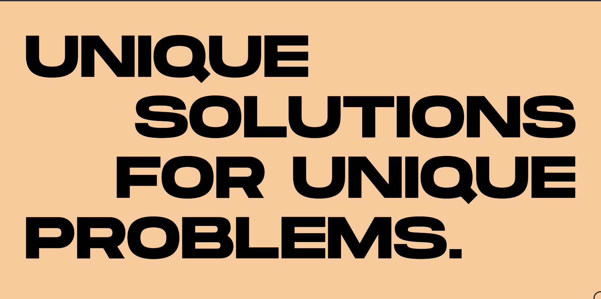

<div id="top"></div>

<!-- PROJECT LOGO -->
<br />
<div align="center">
  <a href="https://github.com/othneildrew/Best-README-Template">
  </a>

  <h3 align="center">Kudzai Mabika SovTech Mini-Portfolio</h3>

  <p align="center">
    <br />
    <a href="">Live Link</a>
  </p>
</div>


<p align="right">(<a href="#top">back to top</a>)</p>


### Built With
* [Next.js](https://nextjs.org/)
* [React.js](https://reactjs.org/)
* [Styled-Components](https://vuejs.org/)
* [Framer-Motion](https://angular.io/)

<p align="right">(<a href="#top">back to top</a>)</p>


<!-- GETTING STARTED -->
## Getting Started

### Prerequisites
Make sure you have [Node](https://nodejs.org/en/) and [git](https://git-scm.com/) installed.

* pnpm
  ```sh
  npm install -g pnpm
  ```

## How to ...

### ... run locally?

- Clone the repo:

  ```bash
  git clone https://github.com/kmabika/mini-portfolio
  cd mini-portfolio
  ```

- Install the dependencies:

  ```bash
  pnpm install
  ```

- Fire up a development server:

  ```bash
  pnpm dev

<p align="right">(<a href="#top">back to top</a>)</p>
